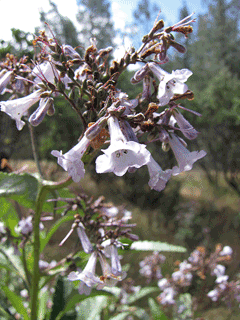

---
{"Note Planted":"2025-04-03","Last Tended":"2025-04-24","publish":true,"PassFrontmatter":true}
---

#🌱Seed   #😐Neutral   #🟡Consideration   #📊Project 
****
> `Importance`: 10%
 
>[!Summary] The Big Idea
> I want to plant a tea garden. Tea has long been something that I enjoy and fascinates me.

Similar Ideas: [[LCOS Notes/LCOS Facility Pattern Language\|LCOS Facility Pattern Language]]
****
# Plant Database
[Plants for a Future](https://pfaf.org/user/) - Plant uses and care 

[Calscape](https://calscape.org/search) - Search Native California Plants

# Place to Buy Seeds and Plants

https://www.fast-growing-trees.com/collections/herb-plants

https://www.tradewindsfruit.com/herbs/

https://www.laspilitas.com/

# A Crazy Idea

> [!Cite] Jacob, Irene, and Walter Jacob. “Flora.” The Anchor Yale Bible Dictionary, edited by David Noel Freedman, vol. 2, Doubleday, 1992, p. 804.
> A number of modern gardens have attempted to recreate biblical flora and to present them to a contemporary audience. In Israel, these include the Biblical Botanical Garden of the Hebrew University (Jerusalem) and the Neot Kedumim (near Tel Aviv). In America, the Denver Botanical Gardens (Colorado) has a Scriptural Garden, and biblical gardens have been created at Rodef Shalom Temple (Pittsburgh) and St. John the Divine Cathedral (New York).

# Unorganized Resource Websites

https://www.cambrianursery.com/gardening/gardening-tips-for-the-california-central-coast-a-guide-from-cambria-nursery/

https://www.sunset.com/home-garden/flowers-plants/diy-tea-blend-ideas

https://www.summerwindsnursery.com/ca/inspire/blog/growing-herbs-for-tea/

https://www.latimes.com/home/la-lh-tea-plants-how-to-grow-20130318-story.html

https://youngmountaintea.com/blogs/blog/grow-your-own-tea-plant?srsltid=AfmBOoobGg6zXG4OkHETbHWWs7Ch2FxlAICNozr8g0M2BzubYm0CP0FP

https://www.gardentech.com/blog/gardening-and-healthy-living/growing-and-brewing-your-own-tea

https://earthdesigngardens.com/easy-edibles-for-the-california-central-coast-food-forest-part-1/

https://www.laspilitas.com/classes/herbs.html

https://california101guide.com/edibleandmedicinalherbs/

https://www.cnps.org/gardening/garden-qa-edible-native-plants-for-the-home-garden-12580

https://www.gardenia.net/plants-by-region/north-america/united-states/western-states/central-california

https://theherbalacademy.com/blog/tea-garden/?srsltid=AfmBOopcORniH3DpsndHdFxjtm2vYPc9cpMKDQfjpdrdRKDUirsF_Ew4

https://arboretum.ucsc.edu/pdfs/ethnobotany-webversion.pdf
***
# Growing Tea Plants Proper
Tips for Growing Tea Herbs in Southern California:

- Sunlight: Most tea herbs thrive in full sun but may appreciate some afternoon shade in the hottest areas. 
- Soil: Use well-draining soil amended with organic matter. 
- Watering: Water regularly, but don't overwater. 
- Harvesting: Harvest leaves as needed throughout the growing season. 
- Drying: Dry leaves in a well-ventilated area away from direct sunlight. 
- Storage: Store dried herbs in airtight containers in a cool, dark place.

While the Mediterranean climate of Orcutt, California, with its warm, dry summers and mild, wet winters, isn't the _ideal_ climate for traditional tea plants (_Camellia sinensis_), it might be possible to grow certain varieties with careful selection and attention to their specific needs.

Here's a breakdown of considerations and potential varieties:

**Challenges of Growing Tea in a Mediterranean Climate:**

- **Water Availability:** Traditional tea plants prefer consistent rainfall and high humidity, which can be a challenge during Orcutt's dry summers.
- **Soil Acidity:** Tea plants thrive in acidic soil (pH 4.5-5.5), and California soils can vary, often being more neutral or even alkaline.  
- **Temperature Fluctuations:** While winters are mild, extreme heat in the summer could stress the plants.

**Potential Tea Plant Varieties for Orcutt (with caveats):**

Given these challenges, you'll want to focus on more resilient varieties and be prepared to provide specific care. Here are some possibilities to explore:

- **Camellia sinensis sinensis:** This variety is generally considered more cold-hardy than _Camellia sinensis assamica_ (which prefers hotter, more humid conditions). It might have a better chance of tolerating the milder winters in Orcutt. Within this variety, look for cultivars known for their hardiness.
    
    - **'Yabukita':** A popular Japanese cultivar known for its good flavor and adaptability. It might be worth trying.  
    - **'Benishibuki':** Another Japanese cultivar that is reported to be relatively hardy.
    
- **Camellia sinensis 'Makura-yama':** This Japanese cultivar is sometimes mentioned as being more adaptable to a wider range of conditions.
- **Hybrids and Experimentation:** Some tea growers in California and other non-traditional regions are experimenting with various hybrids. You might find some smaller nurseries or tea enthusiasts in the state who have had success with specific cultivars adapted to the local conditions.

**Key Considerations for Growing Tea Plants in Orcutt:**

- **Soil Amendment:** You will likely need to amend your soil to increase acidity. This can be done with peat moss, sulfur, or other acidifying amendments. Regular testing of your soil pH is crucial.
- **Watering:** Consistent watering, especially during the dry summer months, will be essential. Consider using drip irrigation to conserve water and provide it directly to the roots. You might also need to provide some shade during the hottest part of the day to reduce water stress.
- **Protection from Harsh Conditions:** Protect young plants from strong winds and intense afternoon sun, especially during their establishment phase.  
- **Microclimate:** Consider the specific microclimate in your garden. Areas with some afternoon shade and slightly higher humidity might be more suitable.
- **Patience:** Growing tea in a non-traditional climate can be a learning process. Be prepared for some trial and error.

**Where to Find Tea Plants:**

- **Specialty Nurseries:** Look for nurseries specializing in rare or unusual plants, or those that focus on tea plants specifically. You might need to order online.
- **Local Horticultural Societies:** Connect with local gardening groups or horticultural societies. They might have members with experience growing tea in your area.

**Important Note:**

While it might be possible to grow some _Camellia sinensis_ in Orcutt, it's important to have realistic expectations. The yield and flavor profile might differ from teas grown in traditional regions. You might find more reliable success and a wider variety of flavors by focusing on the herbal teas mentioned in the previous response, which are generally better suited to the Mediterranean climate.

If you are determined to try growing tea plants, starting with a few different varieties and carefully monitoring their growth and needs would be a good approach. Good luck!

# **Potential Herb Plants** 
## Korean Mint
Name: Agastache rugosa

Could be used as a Tea leaf substitute 
## Chamomile 
Name: _Matricaria recutita_ or _Chamaemelum nobile_

This is a classic choice for a calming and relaxing tea. It thrives in sunny, well-drained conditions, which are typical of your climate. Harvest the flowers when they are fully open and dry them for later use.  They enjoy full sun and well-drained soil. 

For tea, German chamomile (Matricaria chamomilla) is generally preferred for its more prolific blooms and the characteristic sweet, floral taste, while Roman chamomile (Chamaemelum nobile) is known for its milder, slightly earthy flavor and is often used in essential oils and as a groundcover. 
## Mint 
Name: Various species

Mints are incredibly easy to grow and come in a variety of flavors. They prefer partial shade to full sun and moist, well-drained soil, but are quite adaptable. Simply harvest the leaves as needed. Be mindful that mint can spread aggressively, so consider growing it in containers.  
### Corsican Mint
Mentha requienii - Benth.

### Round-Leaved Mint, Apple mint, Pineapple Mint
Name: Mentha suaveolens - Ehrh.

### Spearmint
Name: Mentha spicata - L.

### Peppermint
Name: _Mentha piperita_

### Corn Mint, Wild mint, Field mint
Name: Mentha arvensis

## Yerba buena
Name: _Clinopodium douglasii_ (syn. _Satureja douglasii_)

USDA Hardiness Zones: 7 to 10

Size: Up to 6 inches tall and spreading to 4 feet wide or more

Conditions: Partial to full shade; seasonally or regularly moist soil

Yerba buena may be the finest tea herb that California has to offer. An intoxicatingly fresh lemon scent invigorates and soothes at once. Creeping and scrambling, its stems root where they touch, creating extensive colonies in time. Small white flowers from spring to summer are visited by bees and even draw hummingbirds to ground level. It is an excellent kitchen herb and ground cover under potted plants or among larger perennials. Yerba buena loves regular water but can take long dry periods, especially when planted in shade. It survives short frosts, occurring as far north as Vancouver, Washington.

This native mint, known for its refreshing flavor, is traditionally used for tea. 

## Yerba Santa 
Name: Eriodictyon californicum

California yerba santa (Eriodictyon californicum) is an evergreen shrub in the Borage family hat grows in central and northern California and parts of Oregon. It is commonly found in chaparral, woodlands, and forested areas, thriving in dry, rocky soils. This hardy plant spreads by underground rhizomes, often forming dense thickets that compete with nearby vegetation.

The plant’s long, narrow leaves, which can grow up to six inches, are coated in a sticky resin and often dusted with black fungi. The leaves emit a strong, bitter scent considered unpleasant by most and are generally avoided by animals. In late spring to summer, California yerba santa produces clusters of small, bell-shaped flowers that range from white to light purple, providing nectar for native pollinators.

Traditionally, this plant is valued for its medicinal uses by Indigenous peoples, including as a remedy for respiratory issues and skin conditions. However, it can be aggressive in the garden, so care should be taken to manage its spread.

With its fragrant and somewhat sweet flavor, Yerba Santa tea can be enjoyed regularly by many.
## Butterfly Mint Bush.
Name: *Monardella antonina*
Butterfly Mint Bush, Monardella antonina(sounds better than San Antonio Hills Monardella) is a one foot perennial covered with balls of pale purple with some pink, being worked constantly by every butterfly in our valley. Sometimes two or three on each blossom. The foliage is gray-green with a good minty fragrance. If you use it for tea (excellent with Yerba Buena) use small amounts and do not steep long for it is strong. The flowering period is between July and Dec..

## ‘Russian River’ coyote mint
Name: _Monardella villosa_ ‘Russian River’

Zones: 8 to 11

Size: 1 to 2 feet tall and 2 to 3 feet wide

Conditions: Full sun to partial shade; wide soil tolerance

This excellent evergreen perennial for hot, dry parts of the garden was found near the  
Russian River in Sonoma County, California. Its small oval leaves have a wonderfully fresh, minty smell, like (yet unlike) the garden mints from Europe. ‘Russian River’ coyote mint emits a powerful but lovely scent with the slightest brush against its leaves. Just as wonderful are the bright purple-pink heads of small flowers that adorn every stem tip in late spring and summer. Attractive to bees, butterflies, and hummingbirds, ‘Russian River’ works well as a cut flower, and the leaves work well in nosegays and potpourri.

The aromatic leaves and flower heads can be used to make a refreshing, slightly bitter mint-flavored tea. Indigenous peoples of California traditionally used it to treat stomach upset, respiratory problems, and sore throats.

## Mustang Mint.
Name: Monardella breweri

We are not selling this product. This page is for informational purposes only.
Monardella breweri Mustang Mint - grid24_24
## Lemon Balm 
Name: Melissa officinalis - L.

This herb offers a gentle lemony flavor for tea. It is a vigorous grower, so consider planting it in a container. 
## Anise Hyssop 
Name: Agastache foeniculum - (Pursh.)Kuntze.

Native to the mint family, anise hyssop has a licorice-like flavor. 
## Bergamot, Scarlet beebalm, Horsemint, Oswego Tea, Bee Balm
Name: Monarda didyma

## Wild Bergamot, Mintleaf bergamot, Wild Bee-Balm, Lupine
Name: Monarda fistulosa

## Chaparral nightshade
Name: _Solanum xantii_

Zones: 8 to 11

Size: 2 to 3 feet tall and 3 feet wide

Conditions: Full sun to partial shade; dry, rocky soil (but tolerant of most soils)

While there are many gardenworthy nightshades nationwide, this small, gray-leaved, gray-stemmed species is an excellent one for the hot, dry parts of the garden. Its downy leaves  
reflect some light, keeping the plant cooler and restricting water loss at the same time.  
Tougher in drought than many of its close cousins, chaparral nightshade has flowers that produce a beautiful, delicate smell, similar to that of jasmine. The gentle odor is most noticeable at dusk and dawn. Its flowers are translucent lavender, borne in clusters and often nodding toward the ground. Chaparral nightshade is one of the first plants to wake and begin blooming with California’s autumn rains. It continues to bloom through most of winter and spring.
## Sage 
Name: Salvia officinalis and other culinary sages

Common sage makes a slightly peppery and earthy tea that is often used for its potential medicinal properties. It enjoys full sun and well-drained soil. You can use fresh or dried leaves.  

Culinary sage and other varieties like Cleveland sage are well-suited to the climate and can be used to make a flavorful tea. 

### Sage, Kitchen sage, Small Leaf Sage, Garden Sage
Name: Salvia officinalis - L.

Normal specie that we associate with sage.
### Blue Sage, Fragrant sage, Chaparral Sage
Name: Salvia clevelandii - (A.Gray.)Greene.

The leaves have a pleasant flavour and fragrance, they are a good substitute for sage in cooking.
### White Sage, Compact white sage
Name: Salvia apiana - Jeps.

White Sage (S. apiana) leaves are used sparingly in cooking, especially in teas and herbal preparations.
### Black sage 
Name: Salvia mellifera

Black sage tea has a nice flavor and aroma and is generally safe for regular consumption in moderate amounts.
### Hummingbird sage
Name: _Salvia spathacea_

Zones: 7 to 10

Size: 1 to 2 feet tall, slowly spreads to form colonies at least 4 feet wide

Conditions: Shade is best or some sun with summer water; wide soil tolerance

Hummingbird sage, besides having a gorgeous spring bloom, is adored by hummingbirds, bees, and butterflies. It is one of the best plants for dry shade and is an essential ground cover under mature trees in Southern California. Slowly spreading by underground runners, plants can fill large areas. Very drought tolerant in shade, it does respond well to modest  
irrigation. Each rosette of leaves sends up a large flower stalk (up to 3 feet tall) with whorls of many small magenta flowers. Both leaves and stalks are intensely fragrant. Hummingbird sage enjoys deep leaf litter, although it also does well in formal beds.

This native sage species is known for its vibrant red flowers and the leaves can be used to make tea. 

The leaves of this sage have a distinct fruity aroma and were used by Indigenous Californians to make a decongestant tea. The leaves can be steeped for both hot and cold tea. Its sweeter flavor compared to other sages makes it suitable for culinary uses like shortbread cookies.

### Purple Sage
Name: Salvia leucophylla
Thrives in full sun and well-draining soil, such as sandy or rocky types, and is well-adapted to nutrient-poor soils. It is exceptionally drought-tolerant after establishment.

## Lemon Verbena, Lemon beebrush 
Name: _Aloysia citrodora_ or Aloysia triphylla - Palau

This plant offers a wonderfully bright and lemony flavor perfect for a refreshing tea. It loves full sun and well-drained soil and is quite drought-tolerant once established, making it ideal for your climate. Harvest the leaves throughout the growing season.  

This shrub thrives in warm climates and its leaves have a strong lemon scent and flavor, perfect for a refreshing tea. 
## Blue Elderberry 
Name: Sambucus cerulea (Flowers only):
Elderflower tea is often enjoyed regularly for its pleasant flavor and potential immune-boosting properties. Just be absolutely sure to only use the flowers.  
## White Mulberry 
Name: Morus alba (non-native):
Mulberry leaf tea is typically mild and slightly sweet, making it a good option for regular consumption.  
## Lemonade bush 
Name: Rhus integrifolia and Sugar bush (Rhus ovata):
The tartness of these teas might not be for everyone on a daily basis, especially those with sensitive stomachs. However, if you enjoy the flavor, moderate regular use of the **leaves** is generally considered safe. Use the berries sparingly.
## Nasturtium 
Name: Tropaeolum majus (non-native):
The peppery flavor is likely too strong for regular daily consumption for most people. It's better suited for occasional use.
## Rosemary 
Name: _Salvia rosmarinus_, formerly _Rosmarinus officinalis_
While often used in cooking, rosemary makes an invigorating and flavorful tea with potential health benefits. It's very well-suited to Mediterranean climates, thriving in full sun and well-drained, even poor, soil. Use fresh or dried leaves and sprigs.  

This Mediterranean herb is drought-tolerant and its leaves can be steeped for a savory and earthy tea.
## Lavender 
Name: _Lavandula angustifolia_ and other hardy species
The fragrant flowers of lavender make a calming and floral tea. It loves full sun and well-drained, slightly alkaline soil, which is common in Mediterranean regions. Harvest the flower spikes when the buds are just beginning to open.  

English lavender, with its fragrant flowers, makes a calming and aromatic tea
## Thyme
Name: _Thymus vulgaris_ and other species
Thyme offers a slightly earthy and savory flavor that can be quite pleasant as a tea, especially when you have a cold. It's very drought-tolerant and thrives in full sun and well-drained soil. Use fresh or dried leaves and small stems.  
## Stevia 
A natural sweetener, stevia leaves can be used to add a touch of sweetness to your tea. 

## California Sagebrush
 Name: Artemisia californica

   * Common Names: Coastal sagebrush, California sagewort.

   * Growing Requirements: California sagebrush prefers full sun and dry, well-drained soils, even tolerating poor, rocky conditions. It is highly drought-tolerant once established and requires minimal watering. It is hardy in USDA zones 7-9 and 14-24. Propagate from container stock or direct seeding in fall.

   * Tea Use: The aromatic leaves were traditionally used by Native Americans to make tea for various medicinal purposes.

**Lemongrass:** East Indian and West Indian varieties are used for tea and can be brewed fresh after harvest or dried for later use. The entire plant can be used; leaves can be braided and dried for individual cup steeping.

**Pineapple Sage:** Not only a favorite of hummingbirds; many use it as tea to calm nerves, while aiding in digestion. Flavors are sweet and fruity with a hint of mint and spice.

**Moroccan Mint:** A variety of the classic spearmint, _Mentha spicata_, this herb is most commonly mixed with green tea but would be divine with chamomile or lavender to create an herbal infusion. 

**Tulsi/Holy Basil:** Known for its medicinal benefits, this herb packs a flavorful punch with notes of clove, anise, and peppery spice.

**Mexican Scarlet Sage** (_Salvia gesneriiflora_ ‘Tequila’) has a different growth habit than hummingbird sage. It quickly reaches 10 feet tall and wide, though it can be kept smaller with pruning or trained into a smaller shrub. This sage is also adaptable to sun or shade, and is drought tolerant once established.

**African Blue Basil** (_Ocimum kilimandscharicum × basilicum ‘Dark Opal’_) is a gorgeous perennial basil for the coastal California food forest. It likes full sun and is drought tolerant once established. Its leaves are a bit spicier than annual sweet basils, but delightfully tasty all the same. The pretty little purple flowers are edible too, great for attracting pollinators

Psoralea physodes 
California Tea

- Rosemary (_Rosmarinus officinalis)_
- Rose (_Rosa_ spp.)
- Nettle (_Urtica dioica_)
- Tulsi _(Ocimum tenuiflorum)_
- Echinacea (_Echinacea_ spp.)
- Yarrow (_Achillea millefolium_) 
- Catnip (_Nepeta cataria)_
- Blue vervain (_Verbena hastata)_
- Chamomile (_Matricaria chamomilla)_
- Bachelor’s button (_Centaurea cyanus_)
- Wild bergamot or bee balm (_Monarda fistulosa_)
- Vick’s Plant (_Plectranthus tomentosa_)
- Peppermint (_Mentha piperita_)
- Basil (_Ocimum basilicum_)
- Dill (_Anethum graveolens_)
- Toothache Plant (_Acmella oleracea_)
- Red clover (_Trifolium pratense_)
- Pleurisy root (_Asclepias tuberosa_)
- St. John’s wort (_Hypericum perforatum_)
- Ashwagandha (_Withania somnifera_)
- Sorrel (_Rumex acetosa_)
- Clary sage (_Salvia sclarea_)
- Thyme (_Thymus vulgaris_)
- Borage (_Borago officinalis_)
- Anise hyssop (_Agastache foeniculum_)
- Lemongrass (_Cymbopogon citratus_)
- Lemon verbena (_Aloysia citrodora_)
- Calendula (_Calendula officinalis)_
- Nasturtium (_Tropaeolum majus_)
- Chrysanthemum (_Chrysanthemum morifolium)_
- Mugwort (_Artemisia vulgaris_)
- Skullcap (_Scutellaria lateriflora_)
- Chives (_Allium schoenoprasum_)
- Blue sage (_Salvia azurea_)

# Growing Traditional Tea Plant (Camellia sinensis)
While the Mediterranean climate of Orcutt, California, with its warm, dry summers and mild, wet winters, isn't the ideal climate for traditional tea plants (Camellia sinensis), it might be possible to grow certain varieties with careful selection and attention to their specific needs.
Here's a breakdown of considerations and potential varieties:
Challenges of Growing Tea in a Mediterranean Climate:
 * Water Availability: Traditional tea plants prefer consistent rainfall and high humidity, which can be a challenge during Orcutt's dry summers.
 * Soil Acidity: Tea plants thrive in acidic soil (pH 4.5-5.5), and California soils can vary, often being more neutral or even alkaline.
 * Temperature Fluctuations: While winters are mild, extreme heat in the summer could stress the plants.
Potential Tea Plant Varieties for Orcutt (with caveats):
Given these challenges, you'll want to focus on more resilient varieties and be prepared to provide specific care. Here are some possibilities to explore:
 * Camellia sinensis sinensis: This variety is generally considered more cold-hardy than Camellia sinensis assamica (which prefers hotter, more humid conditions). It might have a better chance of tolerating the milder winters in Orcutt. Within this variety, look for cultivars known for their hardiness.
   * 'Yabukita': A popular Japanese cultivar known for its good flavor and adaptability. It might be worth trying.
   * 'Benishibuki': Another Japanese cultivar that is reported to be relatively hardy.
 * Camellia sinensis 'Makura-yama': This Japanese cultivar is sometimes mentioned as being more adaptable to a wider range of conditions.
 * Hybrids and Experimentation: Some tea growers in California and other non-traditional regions are experimenting with various hybrids. You might find some smaller nurseries or tea enthusiasts in the state who have had success with specific cultivars adapted to the local conditions.
Key Considerations for Growing Tea Plants in Orcutt:
 * Soil Amendment: You will likely need to amend your soil to increase acidity. This can be done with peat moss, sulfur, or other acidifying amendments. Regular testing of your soil pH is crucial.
 * Watering: Consistent watering, especially during the dry summer months, will be essential. Consider using drip irrigation to conserve water and provide it directly to the roots. You might also need to provide some shade during the hottest part of the day to reduce water stress.
 * Protection from Harsh Conditions: Protect young plants from strong winds and intense afternoon sun, especially during their establishment phase.
 * Microclimate: Consider the specific microclimate in your garden. Areas with some afternoon shade and slightly higher humidity might be more suitable.
 * Patience: Growing tea in a non-traditional climate can be a learning process. Be prepared for some trial and error.
Where to Find Tea Plants:
 * Specialty Nurseries: Look for nurseries specializing in rare or unusual plants, or those that focus on tea plants specifically. You might need to order online.
 * Local Horticultural Societies: Connect with local gardening groups or horticultural societies. They might have members with experience growing tea in your area.
Important Note:
While it might be possible to grow some Camellia sinensis in Orcutt, it's important to have realistic expectations. The yield and flavor profile might differ from teas grown in traditional regions. You might find more reliable success and a wider variety of flavors by focusing on the herbal teas mentioned in the list below, which are generally better suited to the Mediterranean climate.
If you are determined to try growing tea plants, starting with a few different varieties and carefully monitoring their growth and needs would be a good approach. Good luck!
# Potential Tea Garden Plants
This list consolidates potential plants for a tea garden, suitable for a Mediterranean climate like the California Central Coast. Use leaves or flowers as specified. Harvest leaves as needed throughout the growing season and dry them in a well-ventilated area away from direct sunlight. Store dried herbs in airtight containers in a cool, dark place.
 * Anise Hyssop (Agastache foeniculum)
   * Native to the mint family, has a licorice-like flavor.
   * Image provided.
 * Bergamot / Bee Balm (Monarda didyma, Monarda fistulosa)
   * Monarda didyma: Also known as Scarlet beebalm, Horsemint, Oswego Tea. Image provided.
   * Monarda fistulosa: Also known as Wild Bergamot, Mintleaf bergamot, Wild Bee-Balm, Lupine. Aromatic leaves and flower heads can be used to make a refreshing, slightly bitter mint-flavored tea. Indigenous peoples of California traditionally used it to treat stomach upset, respiratory problems, and sore throats. Image provided.
 * Blue Elderberry (Sambucus cerulea)
   * Use flowers only for tea. Elderflower tea is often enjoyed regularly for its pleasant flavor and potential immune-boosting properties. Be absolutely sure to only use the flowers.
 * Blue Vervain (Verbena hastata)
 * Borage (Borago officinalis)
 * Calendula (Calendula officinalis)
 * California Sagebrush (Artemisia californica)
   * Common Names: Coastal sagebrush, California sagewort.
   * Growing Requirements: Prefers full sun and dry, well-drained soils, even tolerating poor, rocky conditions. Highly drought-tolerant once established. Hardy in USDA zones 7-9 and 14-24.
   * Tea Use: The aromatic leaves were traditionally used by Native Americans to make tea for various medicinal purposes.
 * California Tea (Psoralea physodes)
 * Catnip (Nepeta cataria)
 * Chamomile (Matricaria recutita or Chamaemelum nobile)
   * A classic choice for a calming and relaxing tea. Thrives in sunny, well-drained conditions. Harvest the flowers when fully open.
   * Matricaria chamomilla (German Chamomile) is generally preferred for its more prolific blooms and sweet, floral taste.
   * Chamaemelum nobile (Roman Chamomile) is known for its milder, slightly earthy flavor.
   * Enjoy full sun and well-drained soil.
   * Image provided (Matricaria recutita or Chamaemelum nobile).
 * Chives (Allium schoenoprasum)
 * Chrysanthemum (Chrysanthemum morifolium)
 * Dill (Anethum graveolens)
 * Echinacea (Echinacea spp.)
 * Korean Mint (Agastache rugosa)
   * Could be used as a Tea leaf substitute.
   * Image provided.
 * Lavender (Lavandula angustifolia and other hardy species)
   * The fragrant flowers make a calming and floral tea. Loves full sun and well-drained, slightly alkaline soil. Harvest flower spikes when buds are just beginning to open.
   * English lavender (Lavandula angustifolia) is well-suited.
   * Image provided (Lavandula angustifolia).
 * Lemon Balm (Melissa officinalis)
   * Offers a gentle lemony flavor. A vigorous grower, consider containers.
   * Image provided.
 * Lemon Verbena (Aloysia citrodora or Aloysia triphylla)
   * Offers a wonderfully bright and lemony flavor. Loves full sun and well-drained soil, quite drought-tolerant once established. Harvest leaves throughout the growing season.
   * Image provided.
 * Lemongrass (Cymbopogon citratus)
   * East Indian and West Indian varieties are used for tea. Can be brewed fresh or dried. The entire plant can be used; leaves can be braided and dried.
 * Lemonade Berry (Rhus integrifolia) and Sugar Bush (Rhus ovata)
   * The tartness might be strong for daily use. Moderate regular use of the leaves is generally considered safe. Use the berries sparingly.
 * Mint (Various species)
   * Incredibly easy to grow. Prefer partial shade to full sun and moist, well-drained soil, but are adaptable. Harvest leaves as needed. Can spread aggressively, consider containers.
   * Corn Mint / Wild Mint / Field Mint (Mentha arvensis) - Image provided.
   * Corsican Mint (Mentha requienii) - Image provided.
   * Moroccan Mint (Mentha spicata var.) - A variety of spearmint, commonly mixed with green tea or other herbs.
   * Peppermint (Mentha piperita) - Image provided.
   * Round-Leaved Mint / Apple Mint / Pineapple Mint (Mentha suaveolens) - Image provided.
   * Spearmint (Mentha spicata) - Image provided.
 * Monardella species
   * Butterfly Mint Bush (Monardella antonina) - Foliage is gray-green with a good minty fragrance. Use small amounts for tea as it is strong, excellent with Yerba Buena. Flowering July-Dec. Image provided.
   * Mustang Mint (Monardella breweri) - Listed as a potential tea plant.
   * ‘Russian River’ Coyote Mint (Monardella villosa ‘Russian River’) - Evergreen perennial for hot, dry areas. Wonderful fresh, minty smell. Bright purple-pink flowers late spring/summer, attractive to pollinators. Very drought tolerant in shade, responds well to modest irrigation.
     * Zones: 8 to 11. Size: 1-2 ft tall, 2-3 ft wide. Conditions: Full sun to partial shade; wide soil tolerance.
     * Image provided.
 * Mugwort (Artemisia vulgaris)
 * Mulberry (Morus alba) - Non-native.
   * Mulberry leaf tea is typically mild and slightly sweet, a good option for regular consumption.
 * Nasturtium (Tropaeolum majus) - Non-native.
   * The peppery flavor is likely too strong for regular daily consumption for most people. Better suited for occasional use. Image provided.
 * Nettle (Urtica dioica)
 * Pineapple Sage (Salvia elegans)
   * Sweet and fruity flavors with a hint of mint and spice. Used as tea to calm nerves and aid digestion. Favorite of hummingbirds.
 * Pleurisy Root (Asclepias tuberosa)
 * Red Clover (Trifolium pratense)
 * Rose (Rosa spp.)
 * Rosemary (Salvia rosmarinus, formerly Rosmarinus officinalis)
   * An invigorating and flavorful tea with potential health benefits. Very well-suited to Mediterranean climates, thriving in full sun and well-drained, even poor, soil. Use fresh or dried leaves and sprigs.
   * Image provided.
 * Sage (Various Salvia species)
   * Common sage makes a slightly peppery and earthy tea, often used for potential medicinal properties. Enjoys full sun and well-drained soil. Use fresh or dried leaves. Culinary sage and other varieties like Cleveland sage are well-suited.
   * Black Sage (Salvia mellifera) - Black sage tea has a nice flavor and aroma and is generally safe for regular consumption in moderate amounts. Image provided.
   * Blue Sage (Salvia azurea, Salvia clevelandii) - Salvia clevelandii also known as Fragrant sage, Chaparral Sage. Leaves have a pleasant flavor and fragrance, a good substitute for sage in cooking. Image provided (Salvia clevelandii).
   * Clary Sage (Salvia sclarea)
   * Hummingbird Sage (Salvia spathacea) - Native species. Adored by hummingbirds, bees, butterflies. One of the best plants for dry shade. Slowly spreads by runners. Drought tolerant in shade, responds to modest irrigation. Leaves and stalks are intensely fragrant. Leaves have a distinct fruity aroma, used by Indigenous Californians to make a decongestant tea. Can be steeped for hot or cold tea. Sweeter flavor makes it suitable for culinary uses.
     * Zones: 7 to 10. Size: 1-2 ft tall, spreads to 4 ft+ wide. Conditions: Shade is best or some sun with summer water; wide soil tolerance.
     * Image provided.
   * Kitchen Sage / Small Leaf Sage / Garden Sage (Salvia officinalis) - Normal species associated with sage. Image provided.
   * Purple Sage (Salvia leucophylla) - Thrives in full sun and well-draining soil (sandy/rocky), adapted to nutrient-poor soils. Exceptionally drought-tolerant after establishment.
   * White Sage / Compact White Sage (Salvia apiana) - Leaves are used sparingly in cooking, especially in teas and herbal preparations. Image provided.
 * Skullcap (Scutellaria lateriflora)
 * Sorrel (Rumex acetosa)
 * Stevia (Stevia rebaudiana)
   * A natural sweetener. Leaves can be used to add sweetness to tea.
 * St. John’s Wort (Hypericum perforatum)
 * Thyme (Thymus vulgaris and other species)
   * Offers a slightly earthy and savory flavor. Very drought-tolerant, thrives in full sun and well-drained soil. Use fresh or dried leaves and small stems.
   * Image provided (Thymus vulgaris).
 * Toothache Plant (Acmella oleracea)
 * Tulsi / Holy Basil (Ocimum tenuiflorum)
   * Known for medicinal benefits. Packs a flavorful punch with notes of clove, anise, and peppery spice. Note: Ocimum basilicum (Basil) was also listed, likely referring to culinary basil which can also be used for tea.
 * Vick’s Plant (Plectranthus tomentosa)
 * White Mulberry (Morus alba) - See Mulberry.
 * Yarrow (Achillea millefolium)
 * Yerba Buena (Clinopodium douglasii, syn. Satureja douglasii)
   * Native mint, known for its refreshing flavor, traditionally used for tea. Perhaps the finest tea herb California has to offer. Intoxicatingly fresh lemon scent. Creeping and scrambling, roots where stems touch, creating colonies. Small white flowers spring-summer attract bees/hummingbirds. Excellent kitchen herb and ground cover. Loves regular water but can take long dry periods, especially in shade. Survives short frosts.
   * USDA Hardiness Zones: 7 to 10. Size: Up to 6 inches tall, spreading to 4 ft+ wide. Conditions: Partial to full shade; seasonally or regularly moist soil.
   * Image provided.
 * Yerba Santa (Eriodictyon californicum)
   * California native evergreen shrub found in chaparral, woodlands, forested areas. Thrives in dry, rocky soils. Spreads by rhizomes. Long, narrow leaves are sticky and resinous. Flowers late spring to summer attract pollinators.
   * Traditionally valued for medicinal uses (respiratory, skin). Can be aggressive in gardens.
   * Fragrant and somewhat sweet flavor. Can be enjoyed regularly by many.
   * Image provided.
