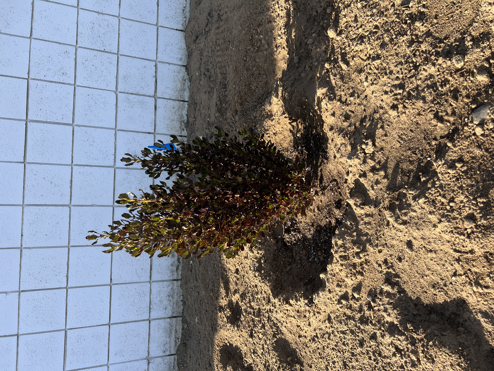
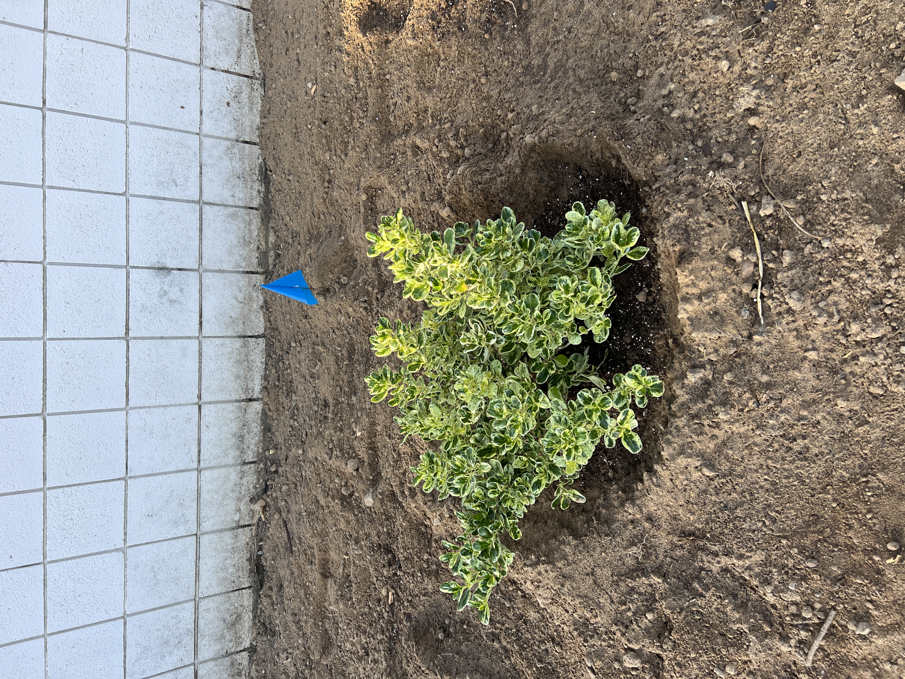
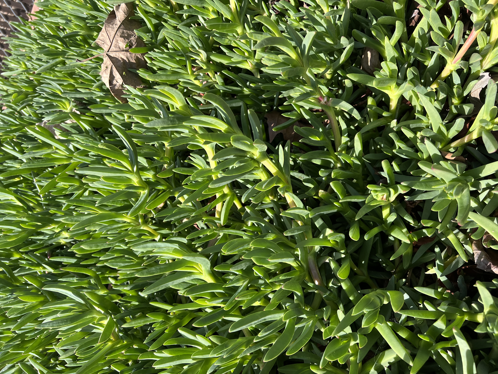
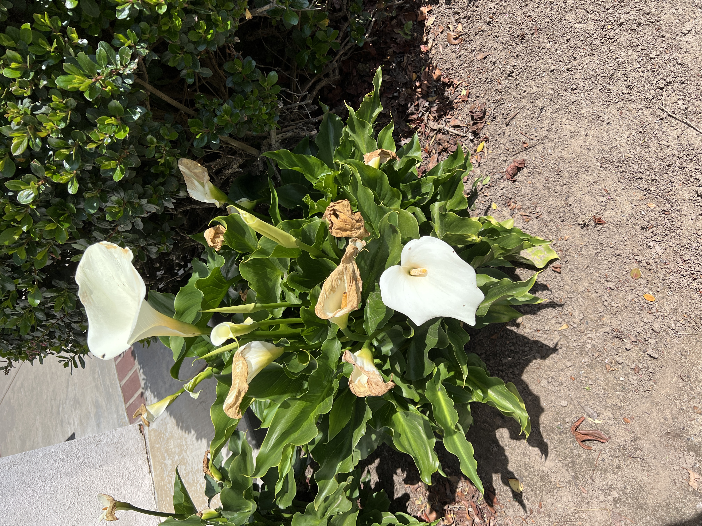
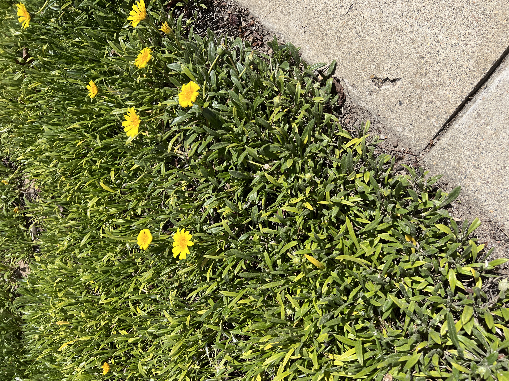
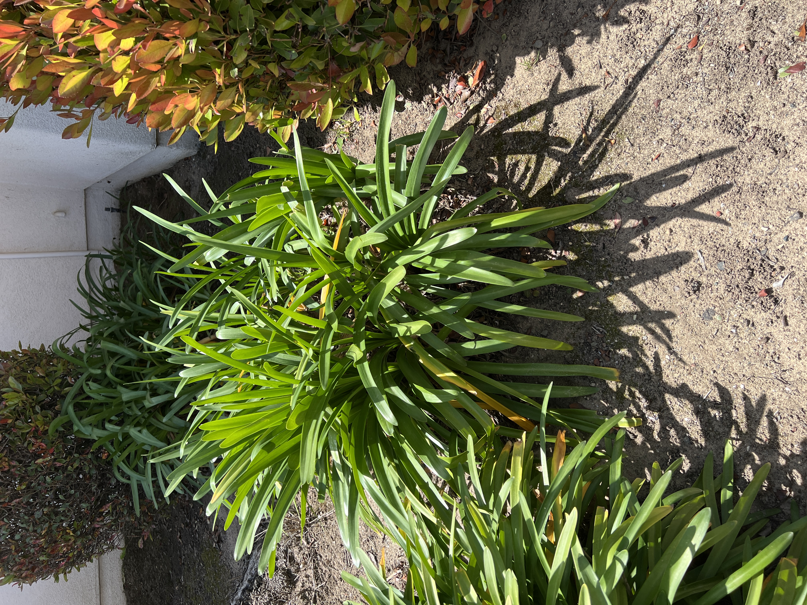
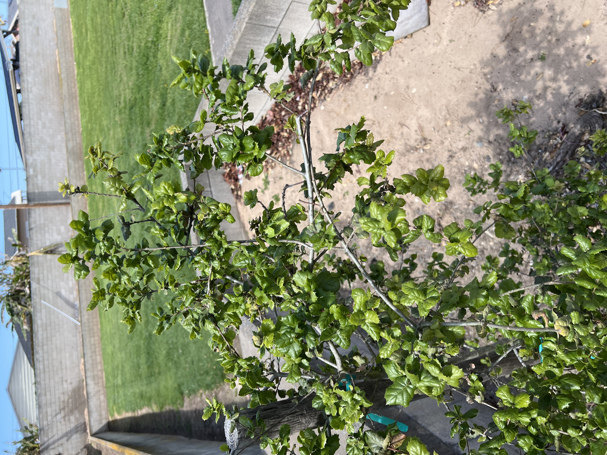
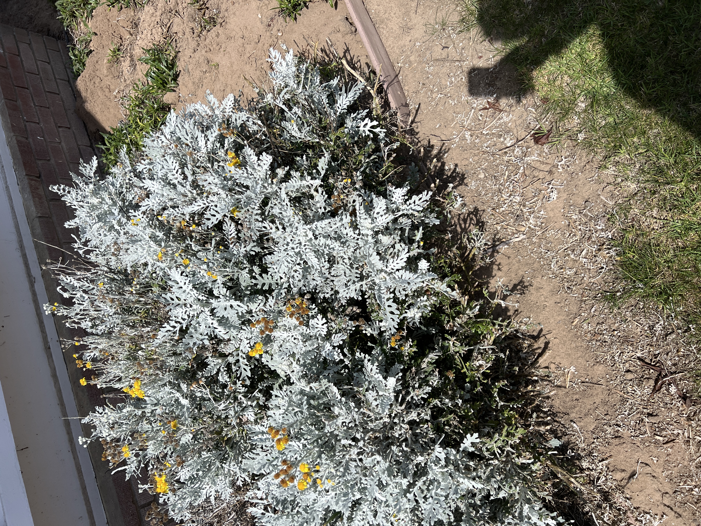

---
{"publish":true,"Note Planted":"2025-03-18","Last Tended":"2025-04-03","PassFrontmatter":true}
---

#🌱Seed   #😐Neutral   #🟡Consideration
****
> `Importance`: 10%
 
>[!Summary] The Big Idea
> Identifications of Plants around LCOS campus

****

# Pacific Sunset Mirror Bush
Name : Coprosma repens 'Jwncopps'

# Marble Queen Mirror Bush
Name: Coprosma repens  

# Pig Face
Name: Carpobrotus glaucescens

# Calla Lily
Name: Zantedeschia

# African Daisy
Name: gazania rigens

# African Lily 
Name: Agapanthus africanus

# California Live Oak
Name: Quercus agrifolia

# Silver Ragwort
Name: Jacobaea maritima
